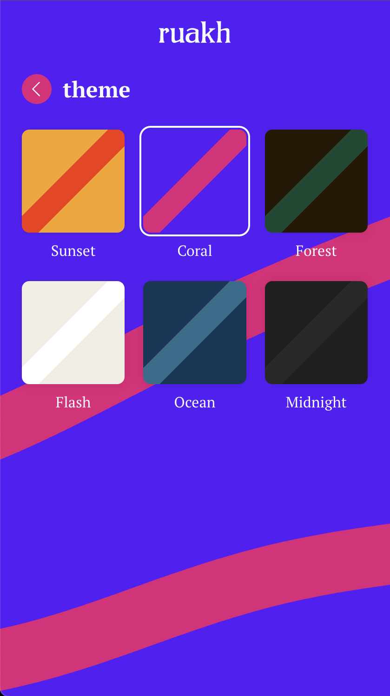

<p align="center">
  
</p>

# ruakh

A self-hostable progressive web app that serves one curated reflection a day to
reflect on. _Ruakh_ (רוּחַ) is the Hebrew word for "breath," "wind," or
"spirit" — in a loud and fast-paced world, this is a space to slow down.

<p align="center">
  
  
  
  
</p>

## Principles

- **The server holds content, not people.** No personal user data is ever
  stored server-side; all user state lives on the device.
- **Self-hostable, no lock-in.** One SvelteKit app + one PostgreSQL database.
  No third-party CMS, auth, or push services.

See [the design spec](docs/superpowers/specs/2026-07-02-ruakh-design.md) for
the full architecture.

## Stack

SvelteKit (adapter-node, Svelte 5) · PostgreSQL · Drizzle ORM · Vitest

## Quickstart

```bash
npm install
cp .env.example .env      # local dev database credentials
docker compose -f docker/compose-dev.yml up -d db   # start PostgreSQL 16
npm run db:migrate        # create the schema
npm run db:seed           # load initial reflections + about content (idempotent)
npm run dev               # http://localhost:5173
```

For the daily push reminder, generate VAPID keys and fill them into `.env`
(`npx web-push generate-vapid-keys`). Optional in dev — without keys the app
runs normally and the reminder scheduler stays idle.

> **Run exactly one app instance.** The reminder scheduler is in-process;
> multiple instances would race and could double-send reminders.

## Scripts

| Script                             | What it does                                               |
| ---------------------------------- | ---------------------------------------------------------- |
| `npm run dev`                      | Dev server with HMR                                        |
| `npm run build` / `npm start`      | Production build / run it (loads `.env`)                   |
| `npm run check`                    | Typecheck (svelte-check)                                   |
| `npm run test:unit` / `test:watch` | Unit tests (Vitest)                                        |
| `npm run db:generate`              | Generate a migration from schema changes                   |
| `npm run db:migrate`               | Apply pending migrations                                   |
| `npm run db:seed`                  | Seed reflections, the about page + themes (safe to re-run) |
| `npm run db:studio`                | Drizzle Studio DB browser                                  |

## Install as an app

Ruakh is a PWA: installable from the browser (on iOS, Share → Add to Home
Screen — installation is required there for the future daily reminder), and
pages you've visited keep working offline.

## How the daily reflection works

A pure, date-seeded function ([src/lib/daily.ts](src/lib/daily.ts)) maps the
current UTC date to an index into the published reflections — same reflection for
everyone each day, rotating through the whole set, nothing stored.

---

Scaffolded with `npx sv@0.16.1 create --template minimal --types ts --install npm .`
(note: this scaffold generation has no `svelte.config.js` — SvelteKit config,
including the node adapter, lives in `vite.config.ts`).

## Development Setup

- Ensure you have a current Node.js (20>=) development environment setup.
- Configure a local .env file with the appropriate environment variables then run:
- Setup docker and [configured with caddy](https://gist.github.com/prowsejeremy/696764a4a6a9ca56181dacd5c934bb24):

```
  docker compose -f docker/compose-dev.yml up
```

Head to [ruakh.test](https://ruakh.test) in your browser and you're off to the races 🐎

## Production build and deployment

This site is designed to be hosted via docker, while it should run on any server supporting docker, the below guide is specifically for configuration on a Lightsail / EC2 Instance.

### Initial setup

#### Configure a Lightsail instance

- Log in to AWS and create a new Lightsail instance
- Configure the IPv4 Firewall rules under networking:
  - SSH | 22 | "Any IPv4 address"
  - HTTP | 80 | "Any IPv4 address"
  - HTTPS | 443 | "Any IPv4 address"

> 📢 **NOTE** For stand-alone EC2:
>
> When creating the security policy, set up the inbound rules matching the above ports configured for the Lightsail firewall.
> These should have an `Source` setting of `0.0.0.0/0`

- Configure a Key pair and download the `.pem` file for ssh access
- Setup a Static IP under networking and attach it to the instance.
  - This will be the public IP for ssh access as well as pointing a domain to.

> 📢 **NOTE** For stand-alone EC2:
>
> Setup an Elastic IP and allocate it to the ec2 instance

#### Install depenencies on Lightsail / ec2 instance

> Run `sh deploy/install-docker.sh` to run through the below commands.

##### Manual process

- SSH onto the server
  ```
  ssh -i path/to/aws-ssh-key.pem ec2-user@static-ip
  ```
- Install Docker
  ```
  sudo yum update -y
  sudo yum install docker -y
  sudo service docker start
  ```
- Setup users
  ```
  sudo usermod -aG docker ec2-user
  ```
- Exit and reconnect to the ec2 instance to verify the user add worked
  ```
  docker info
  ```
- Ensure docker starts if/when the ec2 instance boots
  ```
  sudo systemctl enable docker.service
  sudo systemctl start docker.service
  ```
- Install docker compose
  ```
  sudo mkdir -p /usr/local/lib/docker/cli-plugins
  sudo curl -SL https://github.com/docker/compose/releases/download/v5.0.1/docker-compose-linux-x86_64 -o /usr/local/lib/docker/cli-plugins/docker-compose
  sudo chmod +x /usr/local/lib/docker/cli-plugins/docker-compose
  ```

#### Configure domains and SSL

- Create a `A` name records in your dns provider for any domains you wish to point to the site.
  - These will point to the Elastic IP configured earlier.
- Configure `docker/nginx/default.conf` with your desired domains.
  > **For now ensure the SSL (443) server block is commented out. If not the next steps will fail.**
- Run `sh deploy/build_and_deploy.sh` to build a production version of the app and rsync the required files to the ec2 instance.
  > **NOTE** This will require you configuring your ssh creds in `deploy/connection_variables.sh.`
  >
  > 🚨 **IMPORTANT** Do _NOT_ select to restart the ec2 Docker instance at this point.
- SSH onto the server and start only the nginx container
  ```
  ssh -i path/to/aws-ssh-key.pem ec2-user@static-ip
  cd path/to/app/on/ec2-instance
  docker compose up nginx -d
  ```
- Create directories for certbot to use (note: these should match the volume paths configured in docker/compose.yml for)
  ```
  mkdir -p /certbot/conf
  mkdir -p /certbot/www
  ```
- If the directories have been created, run the following instead:
  ```
  sudo chown -R ec2-user:ec2-user /path/to/app/on/ec2-instance/certbot
  ```
- Perform a dry-run of the certbot generation to ensure everything is configured correctly
  ```
  docker compose run --rm \
    certbot certonly \
    --webroot --webroot-path /var/www/certbot/ \
    --email myemail@provider.com \
    --agree-tos \
    --dry-run \
    -d mydomain.com \
    -d www.mydomain.com
  ```
- If this succeeds then remove the `--dry-run` flag and run again to generate your SSL cert files.
- Run `docker compose down` to stop all containers.
- Close this SSH session
- Back in the local directory, update the nginx config file.
  - In `docker/nginx/default.conf` uncomment the SSL (443) block, ensuring that the `ssl_certificate` and `ssl_certificate_key` paths are configured correctly.
- To push the updated nginx config and start the app, run (note: Consult the scripts to see exactly what is being run.):
  ```
  sh deploy/rsync.sh
  sh deploy/start.sh
  ```

#### Configure SSL Cert renewal process

- To setup the "cron job" to handle renewal of the cert, create the service and timer files:

  ```
  # Service file:
  sudo sh -c 'cat << EOF > /etc/systemd/system/certbot-renew.service
  [Unit]
  Description=Renew certificates
  After=docker.service
  Requires=docker.service

  [Service]
  Type=oneshot
  WorkingDirectory=/home/ec2-user/ruakh
  ExecStart=/usr/bin/docker compose run --rm certbot renew
  ExecStart=/usr/bin/docker compose restart nginx
  EOF'
  ```

  ```
  # Timer file:
  sudo sh -c 'cat << EOF > /etc/systemd/system/certbot-renew.timer
  [Unit]
  Description=Timer to renew certificates

  [Timer]
  OnCalendar=weekly
  Persistent=true

  [Install]
  WantedBy=timers.target
  EOF'
  ```

- Next enable the service and timer, and verify they have been created correctly:

  ```
  sudo systemctl enable certbot-renew.timer
  sudo systemctl start certbot-renew.timer

  # Verify:
  sudo systemctl status certbot-renew.timer --no-pager
  ```

#### Connecting to the remote postgres instance

- When using a tool like [pgAdmin](https://hub.docker.com/r/dpage/pgadmin4/), first ssh onto the instance and find the internal ip address postgres is running on:
  ```
  docker network ls
  docker network inspect {{network_id/name}}
  ```
- Within this response, find the postgres block. The IPv4Address within will be used for our Host name/address:

  In pgAdmin `Properties > Connection`:

  ```
    Host name/address: {IPv4Address}
    Port: 5432
    Username: postgres
    Password: postgres
  ```

  In pgAdmin `Properties > SSH Tunnel`:

  ```
    Tunnel host: {LightsailIPAddress}
    Tunnel port: 22
    Username: ec2-user
    Authentication: Identity file
    Identity file: /etc/ssh/lightsail.pem
  ```

- Copy your .pem file into the local docker pgAdmin container under `/etc/ssh/lightsail.pem`
- Click `Save & Connect` and you should be in.

### Incremental updates

- To build the docker image and upload it to the ec2 instance:

```
sh deploy/build_and_deploy.sh
```
