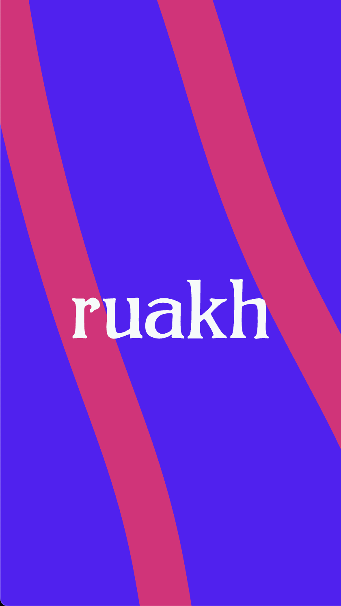
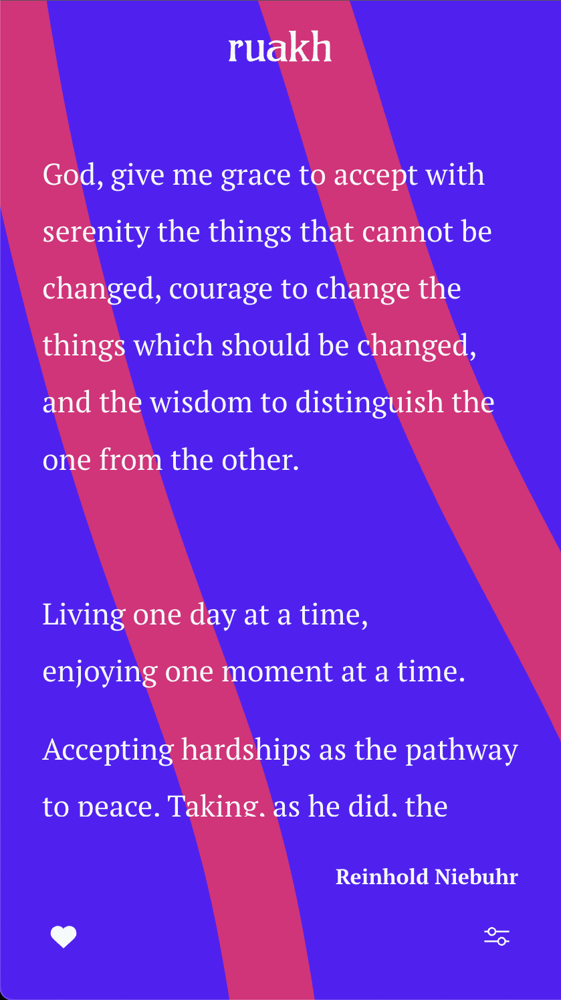
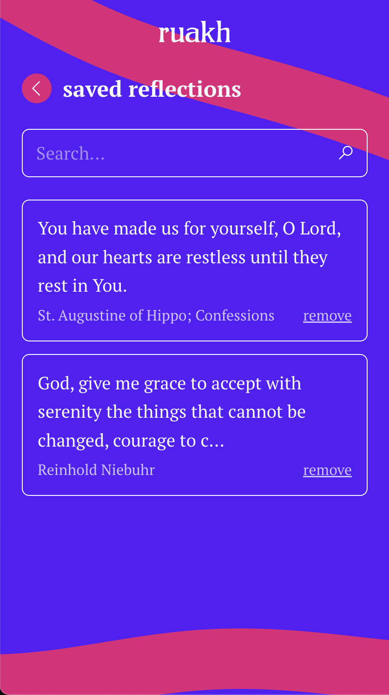

<p align="center">
  
</p>

# ruakh

A self-hostable progressive web app that serves one curated reflection a day to
reflect on. _Ruakh_ (רוּחַ) is the Hebrew word for "breath," "wind," or
"spirit" — in a loud and fast-paced world, this is a space to slow down.

<p align="center">
  
  
  
  
</p>

## Principles

- **The server holds content, not people.** No personal user data is ever
  stored server-side; all user state lives on the device.
- **Self-hostable, no lock-in.** One SvelteKit app + one PostgreSQL database.
  No third-party CMS, auth, or push services.

See [the design spec](docs/superpowers/specs/2026-07-02-ruakh-design.md) for
the full architecture.

## Stack

SvelteKit (adapter-node, Svelte 5) · PostgreSQL · Drizzle ORM · Vitest

## Quickstart

```bash
npm install
cp .env.example .env      # local dev database credentials
docker compose up -d      # start PostgreSQL 16
npm run db:migrate        # create the schema
npm run db:seed           # load initial reflections + about content (idempotent)
npm run dev               # http://localhost:5173
```

For the daily push reminder, generate VAPID keys and fill them into `.env`
(`npx web-push generate-vapid-keys`). Optional in dev — without keys the app
runs normally and the reminder scheduler stays idle.

> **Run exactly one app instance.** The reminder scheduler is in-process;
> multiple instances would race and could double-send reminders.

## Scripts

| Script                             | What it does                                               |
| ---------------------------------- | ---------------------------------------------------------- |
| `npm run dev`                      | Dev server with HMR                                        |
| `npm run build` / `npm start`      | Production build / run it (loads `.env`)                   |
| `npm run check`                    | Typecheck (svelte-check)                                   |
| `npm run test:unit` / `test:watch` | Unit tests (Vitest)                                        |
| `npm run db:generate`              | Generate a migration from schema changes                   |
| `npm run db:migrate`               | Apply pending migrations                                   |
| `npm run db:seed`                  | Seed reflections, the about page + themes (safe to re-run) |
| `npm run db:studio`                | Drizzle Studio DB browser                                  |

## Install as an app

Ruakh is a PWA: installable from the browser (on iOS, Share → Add to Home
Screen — installation is required there for the future daily reminder), and
pages you've visited keep working offline.

## How the daily reflection works

A pure, date-seeded function ([src/lib/daily.ts](src/lib/daily.ts)) maps the
current UTC date to an index into the published reflections — same reflection for
everyone each day, rotating through the whole set, nothing stored.

---

Scaffolded with `npx sv@0.16.1 create --template minimal --types ts --install npm .`
(note: this scaffold generation has no `svelte.config.js` — SvelteKit config,
including the node adapter, lives in `vite.config.ts`).
